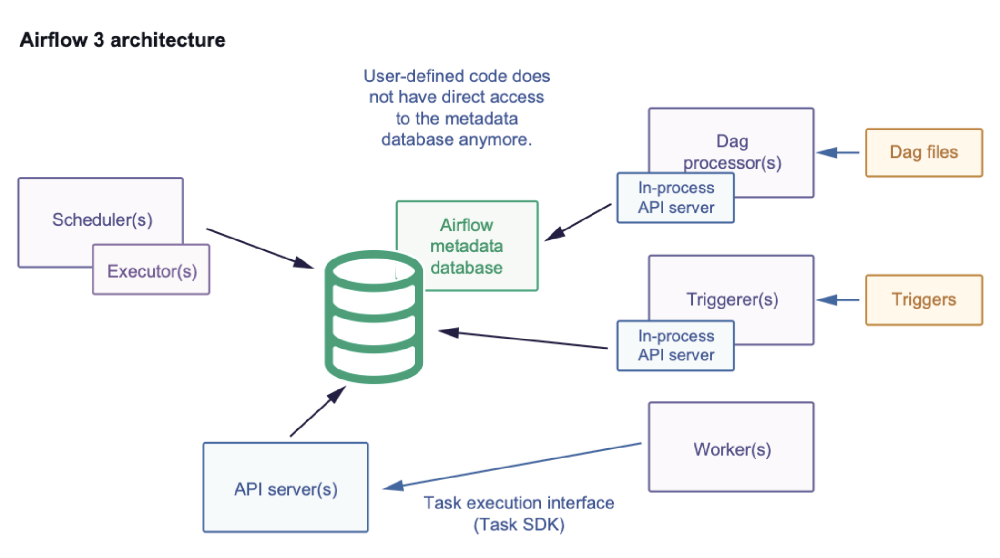

  

# Apache Airflow
https://airflow.apache.org/

Apache Airflow es una plataforma de código abierto para crear, programar y monitorear flujos de trabajo (pipelines de datos) de forma programática, definiéndolos como código Python en estructuras llamadas DAGs (Directed Acyclic Graphs), permitiendo orquestar tareas complejas, gestionar dependencias y automatizar procesos de datos a gran escala, con una interfaz web para visualización y resolución de problemas. 

**Características principales**

- Código como configuración: Los flujos de trabajo se definen en scripts Python, facilitando su versionado, pruebas y colaboración.
- DAGs (Directed Acyclic Graphs): Representan flujos de trabajo con tareas y sus dependencias, asegurando un orden de ejecución sin bucles.
- Orquestación: Actúa como un director, ejecutando tareas en un orden específico, manejando fallos y reintentos.
- Extensible y Conectable: Incluye operadores para interactuar con sistemas externos (Bash, Spark, Bases de Datos, APIs) y permite crear plugins personalizados.
- Interfaz de Usuario (UI): Permite visualizar el progreso, monitorear DAGs, consultar logs y resolver problemas.
Escalable: Arquitectura modular y distribuida, capaz de manejar miles de tareas. 

Apache Airflow es una plataforma open source para orquestación de flujos de trabajo (workflows), diseñada para planificar, ejecutar, monitorear y administrar pipelines de datos o procesos automatizados.

Airflow permite definir los workflows como código Python (Workflow as Code), lo que facilita:

- versionamiento (Git),
- revisión por pares,
- reproducibilidad,
- reutilización,
- despliegue CI/CD.

**Qué problema resuelve**

En proyectos reales, es común tener procesos dependientes entre sí:

- “extraer datos → transformar → cargar → validar → notificar”
- “si falla X, no ejecutes Y”
- “si termina Z, dispara un pipeline downstream”
- “quiero re-ejecutar solo el día 2026-01-12”

Airflow resuelve esto con una capa robusta de:

- DAGs (grafos de tareas dependientes),
- scheduler (planificación),
- workers (ejecución),
- observabilidad (logs, UI, métricas),
- reintentos, SLAs, alertas.

## Arquitectura

