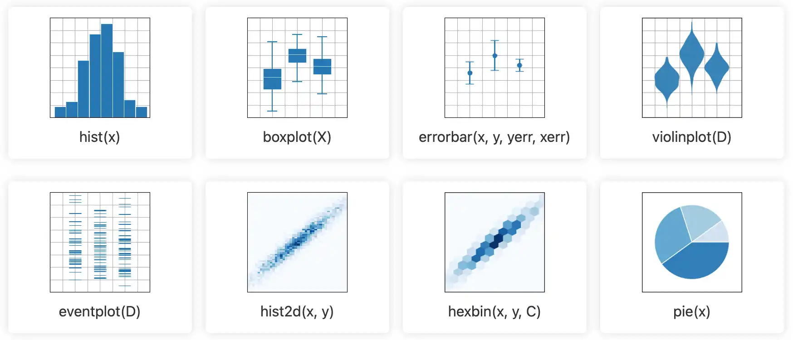
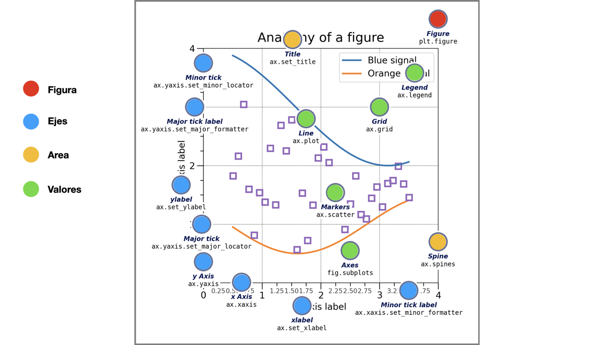

# 📊 Visualización de Datos
La vieja máxima "una imagen vale más que mil palabras" es especialmente cierta en el campo de la ciencia de datos. La visualización de datos es una herramienta esencial para comunicar hallazgos, identificar patrones y tomar decisiones informadas basadas en datos complejos. En este módulo, aprenderás a crear gráficos efectivos utilizando bibliotecas populares como Matplotlib y Seaborn, y a diseñar dashboards interactivos para presentar tus análisis de manera clara y atractiva.

**Objetivo del módulo:** Aprender a comunicar hallazgos mediante gráficos eficaces.

**Resultados de Aprendizaje:**
- Generar visualizaciones claras y persuasivas.

**Contenidos:**
1. Principios de visualización
2. [Matplotlib](Matplotlib.ipynb)
3. [Seaborn](Seaborn.ipynb)
4. Dashboards básicos con Plotly Express
5. [Storytelling con datos](Storytelling.ipynb)
6. [Streamlit](Streamlit.md)

## Principios generales de visualización

**Anatomía general de un gráfico**

La gran mayoría de gráficos comparten los mismos elementos:
- Un área de gráficos
- Ejes, que contienen los valores, categorías y marcas, mayores y menores
- Valores, contenidos en líneas o barras u otros

Por lo que el aprendizaje en uno de ellos facilita aprender otro nuevo.

